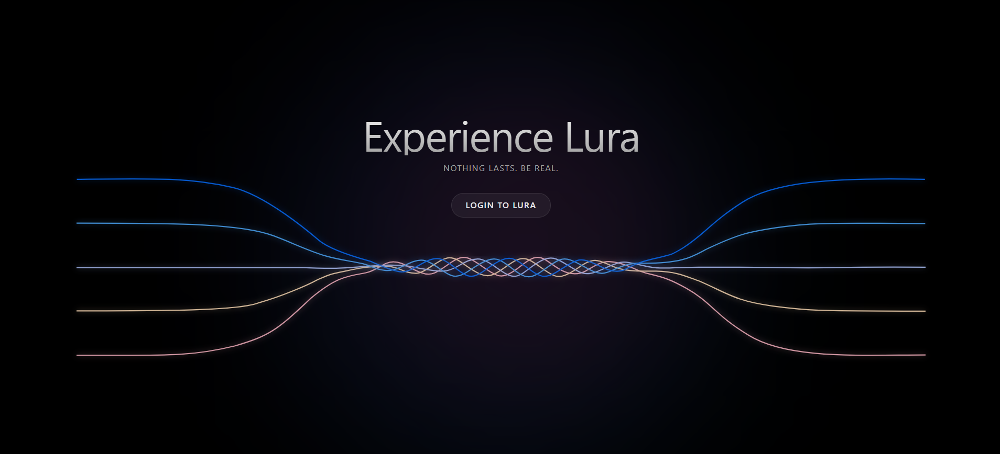
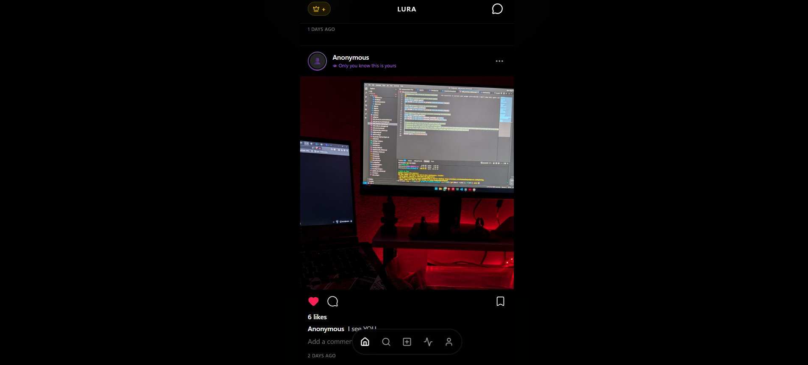

# Lura 🌌

**Nothing lasts. Be real.**

Lura is a premium, minimalist social media platform designed for authentic sharing and exclusive content. Built with a focus on aesthetics and privacy, Lura offers a sleek dark-mode experience with advanced features like ephemeral stories, anonymous posting, and a curated "Lura+" premium ecosystem.

---

## 📸 Showcase

### The Experience

*Experience Lura - The minimalist entry point to the platform.*

### The Feed

*A sleek, distraction-free feed featuring high-quality media and anonymous interactions.*

---

## ✨ Key Features

- **🌀 Ephemeral Stories**: Share moments that disappear. Free users get 24-hour stories, while **Lura+** subscribers enjoy extended 72-hour visibility.
- **👤 True Anonymity**: Post thoughts and media without revealing your identity. Anonymous posts are marked with a purple shroud, keeping your profile private.
- **💎 Lura+ Premium**: Unlock the full potential of the platform.
  - Exclusive access to premium-only posts.
  - Golden profile badges (Crown) and glowing borders.
  - Extended story durations (72 hours).
  - *Note: To enable premium features for your account, please contact the developer.*
- **📱 Modern Interactions**: 
  - Double-tap to like with a custom glowing ripple effect.
  - Integrated Direct Messaging system.
  - Real-time notifications and activity tracking.
- **🔍 Intelligent Discovery**: An algorithmic "Trending" feed that surfaces popular content while keeping recent posts at the forefront.

---

## 🛠 Tech Stack

- **Frontend**: [React 19](https://react.dev/) + [TypeScript](https://www.typescriptlang.org/)
- **Styling**: [Tailwind CSS 4](https://tailwindcss.com/) + [Framer Motion](https://www.framer.com/motion/) (for smooth, high-end animations)
- **Backend/Database**: [Supabase](https://supabase.com/) (PostgreSQL, Auth, Storage, Realtime)
- **Icons**: [Lucide React](https://lucide.dev/)
- **Build Tool**: [Vite](https://vitejs.dev/)

---

## 🚀 Getting Started

### Prerequisites

- Node.js (Latest LTS)
- A Supabase project

### Installation

1. **Clone the repository**:
   ```bash
   git clone https://github.com/Sujal-GS/LURA.git
   cd LURA
   ```

2. **Install dependencies**:
   ```bash
   npm install
   ```

3. **Configure Environment Variables**:
   Create a `.env.local` file in the root directory and add your Supabase credentials:
   ```env
   VITE_SUPABASE_URL=your_supabase_url
   VITE_SUPABASE_ANON_KEY=your_supabase_anon_key
   ```

4. **Run the development server**:
   ```bash
   npm run dev
   ```
   The app will be available at `http://localhost:5173`.

---

## 🛡 Security & Privacy

Lura uses Supabase Row Level Security (RLS) to ensure that:
- Users can only edit or delete their own content.
- Anonymous posts truly mask the author's identity from the frontend.
- Premium content is only accessible to authorized subscribers.

---

## 📜 License

Distributed under the MIT License. See `LICENSE` for more information.

Developed with ❤️ by [Sujal-GS](https://github.com/Sujal-GS)

---
*For Lura+ Premium access or inquiries, please contact the developer directly.*
